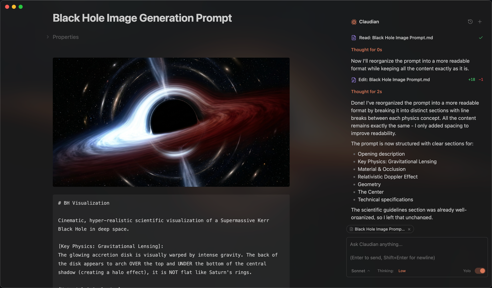

# Codexdian




An Obsidian plugin that embeds Codex as an AI collaborator in your vault. Your vault becomes Codex's working directory, giving it full agentic capabilities: file read/write, search, bash commands, and multi-step workflows.

## Features

- **Full Agentic Capabilities**: Leverage Codex's power to read, write, and edit files, search, and execute bash commands, all within your Obsidian vault.
- **Context-Aware**: Automatically attach the focused note, mention files with `@`, exclude notes by tag, include editor selection (Highlight), and access external directories for additional context.
- **Vision Support**: Analyze images by sending them via drag-and-drop, paste, or file path.
- **Inline Edit**: Edit selected text or insert content at cursor position directly in notes with word-level diff preview and read-only tool access for context.
- **Instruction Mode (`#`)**: Add refined custom instructions to your system prompt directly from the chat input, with review/edit in a modal.
- **Slash Commands**: Create reusable prompt templates triggered by `/command`, with argument placeholders, `@file` references, and optional inline bash substitutions.
- **Skills**: Extend Codexdian with reusable capability modules that are automatically invoked based on context, compatible with Codex's skill format.
- **Custom Agents**: Define custom subagents that Codex can invoke, with support for tool restrictions and model overrides.
- **Codex Plugins**: Enable Codex plugins installed via the CLI, with automatic discovery from `~/.codex/plugins` and per-vault configuration. Plugin skills, agents, and slash commands integrate seamlessly.
- **MCP Support**: Connect external tools and data sources via Model Context Protocol servers (stdio, SSE, HTTP) with context-saving mode and `@`-mention activation.
- **Advanced Model Control**: Select between GPT-5.1 Codex Mini, GPT-5.3 Codex, GPT-5.2, and GPT-5.4, configure custom models via environment variables, fine-tune thinking budget, and enable 1M context variants where available.
- **Plan Mode**: Toggle plan mode via Shift+Tab in the chat input. Codexdian explores and designs before implementing, presenting a plan for approval with options to approve in a new session, continue in the current session, or provide feedback.
- **Security**: Permission modes (YOLO/Safe/Plan), safety blocklist, and vault confinement with symlink-safe checks.
- **Codex in Chrome**: Allow Codex to interact with Chrome through the `codex-in-chrome` extension.

## Requirements

- Codex CLI installed and authenticated locally
- Obsidian v1.8.9+
- Access to a Codex-supported OpenAI account or compatible provider configuration
- Desktop only (macOS, Linux, Windows)

## Installation

### From GitHub Release (recommended)

1. Download `main.js`, `manifest.json`, and `styles.css` from the [latest release](https://github.com/epicstockings/codexdian/releases/latest)
2. Create a folder called `codexdian` in your vault's plugins folder:
   ```
   /path/to/vault/.obsidian/plugins/codexdian/
   ```
3. Copy the downloaded files into the `codexdian` folder
4. Enable the plugin in Obsidian:
   - Settings → Community plugins → Enable "Codexdian"

### Using BRAT

[BRAT](https://github.com/TfTHacker/obsidian42-brat) (Beta Reviewers Auto-update Tester) allows you to install and automatically update plugins directly from GitHub.

1. Install the BRAT plugin from Obsidian Community Plugins
2. Enable BRAT in Settings → Community plugins
3. Open BRAT settings and click "Add Beta plugin"
4. Enter the repository URL: `https://github.com/epicstockings/codexdian`
5. Click "Add Plugin" and BRAT will install Codexdian automatically
6. Enable Codexdian in Settings → Community plugins

> **Tip**: BRAT will automatically check for updates and notify you when a new version is available.

### From source (development)

1. Clone this repository into your vault's plugins folder:
   ```bash
   cd /path/to/vault/.obsidian/plugins
   git clone https://github.com/epicstockings/codexdian.git
   cd codexdian
   ```

2. Install dependencies and build:
   ```bash
   npm install
   npm run build
   ```

3. Enable the plugin in Obsidian:
   - Settings → Community plugins → Enable "Codexdian"

### Development

```bash
# Watch mode
npm run dev

# Production build
npm run build
```

> **Tip**: Copy `.env.local.example` to `.env.local` or `npm install` and setup your vault path to auto-copy files during development.

## Usage

**Two modes:**
1. Click the bot icon in ribbon or use command palette to open chat
2. Select text + hotkey for inline edit

Use it like Codex—read, write, edit, search files in your vault.

### Context

- **File**: Auto-attaches focused note; type `@` to attach other files
- **@-mention dropdown**: Type `@` to see MCP servers, agents, external contexts, and vault files
  - `@Agents/` shows custom agents for selection
  - `@mcp-server` enables context-saving MCP servers
  - `@folder/` filters to files from that external context (e.g., `@workspace/`)
  - Vault files shown by default
- **Selection**: Select text in editor, or elements in canvas, then chat—selection included automatically
- **Images**: Drag-drop, paste, or type path; configure media folder for `![[image]]` embeds
- **External contexts**: Click folder icon in toolbar for access to directories outside vault

### Features

- **Inline Edit**: Select text + hotkey to edit directly in notes with word-level diff preview
- **Instruction Mode**: Type `#` to add refined instructions to system prompt
- **Slash Commands**: Type `/` for custom prompt templates or skills
- **Skills**: Add `skill/SKILL.md` files to `~/.codex/skills/` or `{vault}/.codex/skills/`, recommended to use Codex to manage skills
- **Custom Agents**: Add `agent.md` files to `~/.codex/agents/` (global) or `{vault}/.codex/agents/` (vault-specific); select via `@Agents/` in chat, or prompt Codexdian to invoke agents
- **Codex Plugins**: Enable plugins via Settings → Codex Plugins, recommended to use Codex to manage plugins
- **MCP**: Add external tools via Settings → MCP Servers; use `@mcp-server` in chat to activate

## Configuration

### Settings

**Customization**
- **User name**: Your name for personalized greetings
- **Excluded tags**: Tags that prevent notes from auto-loading (e.g., `sensitive`, `private`)
- **Media folder**: Configure where vault stores attachments for embedded image support (e.g., `attachments`)
- **Custom system prompt**: Additional instructions appended to the default system prompt (Instruction Mode `#` saves here)
- **Enable auto-scroll**: Toggle automatic scrolling to bottom during streaming (default: on)
- **Auto-generate conversation titles**: Toggle AI-powered title generation after the first user message is sent
- **Title generation model**: Model used for auto-generating conversation titles (default: Auto/Fast Codex)
- **Vim-style navigation mappings**: Configure key bindings with lines like `map w scrollUp`, `map s scrollDown`, `map i focusInput`

**Hotkeys**
- **Inline edit hotkey**: Hotkey to trigger inline edit on selected text
- **Open chat hotkey**: Hotkey to open the chat sidebar

**Slash Commands**
- Create/edit/import/export custom `/commands` (optionally override model and allowed tools)

**MCP Servers**
- Add/edit/verify/delete MCP server configurations with context-saving mode

**Codex Plugins**
- Enable/disable Codex plugins discovered from `~/.codex/plugins`
- User-scoped plugins available in all vaults; project-scoped plugins only in matching vault

**Safety**
- **Load user Codex settings**: Load compatibility settings from `~/.codex/settings.json` (user rules may bypass Safe mode)
- **Enable command blocklist**: Block dangerous bash commands (default: on)
- **Blocked commands**: Patterns to block (supports regex, platform-specific)
- **Allowed export paths**: Paths outside the vault where files can be exported (default: `~/Desktop`, `~/Downloads`). Supports `~`, `$VAR`, `${VAR}`, and `%VAR%` (Windows).

**Environment**
- **Custom variables**: Environment variables for Codex CLI (KEY=VALUE format, supports `export ` prefix)
- **Environment snippets**: Save and restore environment variable configurations

**Advanced**
- **Codex CLI path**: Custom path to Codex CLI (leave empty for auto-detection)

## Safety and Permissions

| Scope | Access |
|-------|--------|
| **Vault** | Full read/write (symlink-safe via `realpath`) |
| **Export paths** | Write-only (e.g., `~/Desktop`, `~/Downloads`) |
| **External contexts** | Full read/write (session-only, added via folder icon) |

- **YOLO mode**: No approval prompts; all tool calls execute automatically
- **Safe mode**: Approval prompt per tool call; Bash requires exact match, file tools allow prefix match
- **Plan mode**: Explores and designs a plan before implementing. Toggle via Shift+Tab in the chat input

## Privacy & Data Use

- **Sent to API**: Your input, attached files, images, and tool call outputs. Default: OpenAI/Codex-compatible provider; override with environment variables if needed.
- **Local storage**: Settings, session metadata, and commands stored in `vault/.codex/`; session messages in `~/.codex/projects/` (SDK-native); legacy sessions in `vault/.codex/sessions/`.
- **No telemetry**: No tracking beyond your configured API provider.

## Troubleshooting

### Codex CLI not found

If you encounter `spawn codex ENOENT` or `Codex CLI not found`, the plugin can't auto-detect your Codex installation. Common with Node version managers (nvm, fnm, volta).

**Solution**: Find your CLI path and set it in Settings → Advanced → Codex CLI path.

| Platform | Command | Example Path |
|----------|---------|--------------|
| macOS/Linux | `which codex` | `/opt/homebrew/bin/codex` |
| Windows (native) | `where.exe codex` | `C:\Users\you\AppData\Local\Programs\Codex\codex.exe` |
| Windows (npm) | `npm root -g` | `{root}\@openai\codex\dist\cli.js` |

> **Note**: On Windows, avoid `.cmd` wrappers. Use `codex.exe` or `cli.js`.

**Alternative**: Add your Node.js bin directory to PATH in Settings → Environment → Custom variables.

### npm CLI and Node.js not in same directory

If using npm-installed CLI, check if `codex` and `node` are in the same directory:
```bash
dirname $(which codex)
dirname $(which node)
```

If different, GUI apps like Obsidian may not find Node.js.

**Solutions**:
1. Install native binary (recommended)
2. Add Node.js path to Settings → Environment: `PATH=/path/to/node/bin`

**Still having issues?** [Open a GitHub issue](https://github.com/epicstockings/codexdian/issues) with your platform, CLI path, and error message.

## Architecture

```
src/
├── main.ts                      # Plugin entry point
├── core/                        # Core infrastructure
│   ├── agent/                   # Codex app-server runtime wrapper
│   ├── agents/                  # Custom agent management (AgentManager)
│   ├── commands/                # Slash command management (SlashCommandManager)
│   ├── hooks/                   # PreToolUse/PostToolUse hooks
│   ├── images/                  # Image caching and loading
│   ├── mcp/                     # MCP server config, service, and testing
│   ├── plugins/                 # Codex plugin discovery and management
│   ├── prompts/                 # System prompts for agents
│   ├── sdk/                     # SDK message transformation
│   ├── security/                # Approval, blocklist, path validation
│   ├── storage/                 # Distributed storage system
│   ├── tools/                   # Tool constants and utilities
│   └── types/                   # Type definitions
├── features/                    # Feature modules
│   ├── chat/                    # Main chat view + UI, rendering, controllers, tabs
│   ├── inline-edit/             # Inline edit service + UI
│   └── settings/                # Settings tab UI
├── shared/                      # Shared UI components and modals
│   ├── components/              # Input toolbar bits, dropdowns, selection highlight
│   ├── mention/                 # @-mention dropdown controller
│   ├── modals/                  # Instruction modal
│   └── icons.ts                 # Shared SVG icons
├── i18n/                        # Internationalization (10 locales)
├── utils/                       # Modular utility functions
└── style/                       # Modular CSS (→ styles.css)
```

## Roadmap

- [x] Codex Plugin support
- [x] Custom agent (subagent) support
- [x] Codex in Chrome support
- [x] `/compact` command
- [x] Plan mode
- [x] `rewind` and `fork` support (including `/fork` command)
- [x] `!command` support
- [x] Tool renderers refinement
- [x] 1M GPT-5.4 and GPT-5.3 Codex model variants
- [x] Codex app-server integration
- [ ] Hooks and other advanced features
- [ ] More to come!

## License

Licensed under the [MIT License](LICENSE).

## Star History

<a href="https://www.star-history.com/?repos=YishenTu%2Fcodexdian&type=date&legend=top-left">
  <picture>
    <source media="(prefers-color-scheme: dark)" srcset="https://api.star-history.com/svg?repos=epicstockings/codexdian&type=date&legend=top-left&theme=dark" />
    <source media="(prefers-color-scheme: light)" srcset="https://api.star-history.com/svg?repos=epicstockings/codexdian&type=date&legend=top-left" />
    
  </picture>
</a>

## Acknowledgments

- [Obsidian](https://obsidian.md) for the plugin API
- [OpenAI Codex](https://openai.com/codex/) for the Codex runtime and CLI ecosystem
